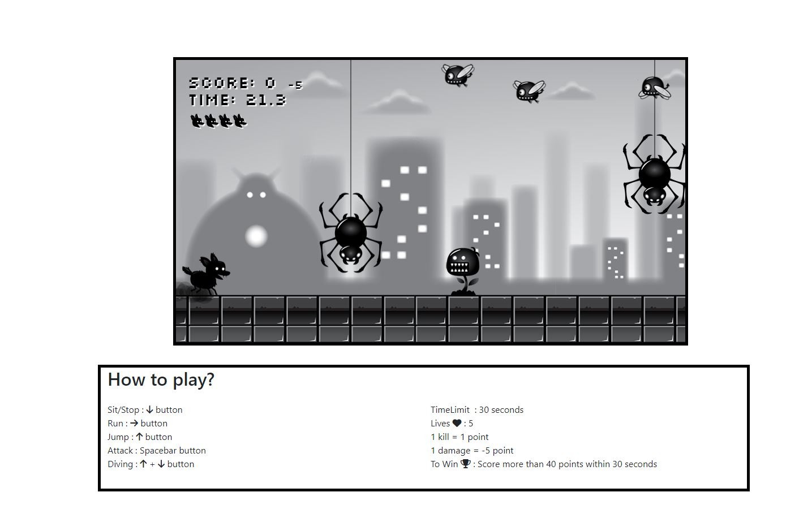

# Javascript Game

 A 2D game made using primally on Javascript

 ## Project Description
A 2 Dimensional game project build on HTML, CSS and Javascript. A project learn from [Youtube](https://www.youtube.com/watch?v=GFO_txvwK_c).

Click [here](https://2d-javascript-game.netlify.app/) to play now!

## How to play the game !
The objective of the game would be to score more than 40 points within 30 seconds by attacking the monsters using simple keys such as arrow keys and spacebar key to control the player. 